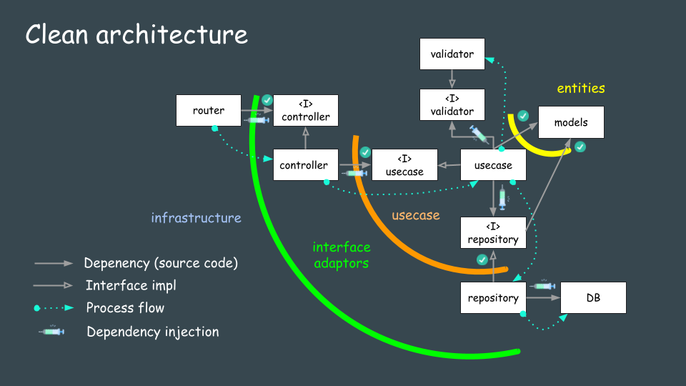

``` bash
# create module
go mod init go-rest-api
# start db
docker compose up -d
# remove db
docker compose rm -s -f -v
# start app
GO_ENV=dev go run .
# run migrate
GO_ENV=dev go run migrate/migrate.go
```
<h2 id="architecture">Architecture of REST API (Go/Echo) application</h2>

